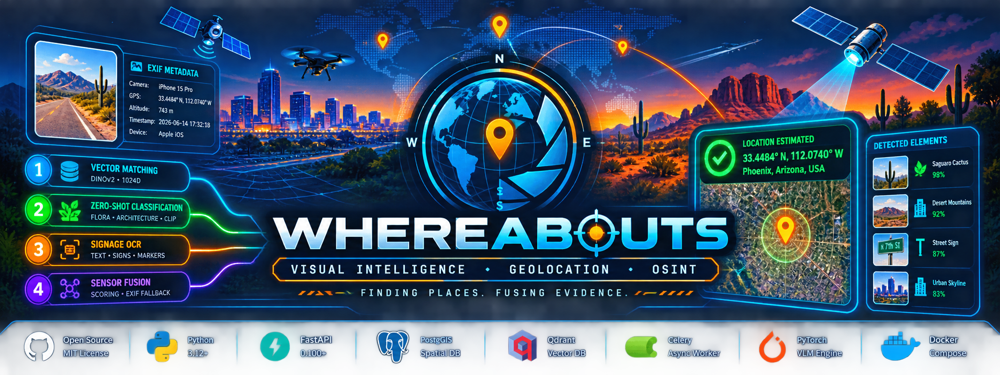

<div align="center">



<br/>

# Whereabouts
### Enterprise Visual Intelligence & Geolocation

<p>
  <strong>Evidence fusion for determining where visual media was captured.</strong><br/>
  Analyze images and video by combining visual embeddings, zero-shot scene classification,
  signage OCR, and embedded EXIF telemetry.
</p>

<p>
  <a href="#-architecture">Architecture</a> •
  <a href="#-quick-start">Quick Start</a> •
  <a href="#-inference-pipeline">Inference Pipeline</a> •
  <a href="#-api-usage">API Usage</a> •
  <a href="#-live-telemetry-dashboard">Dashboard</a> •
  <a href="#-troubleshooting">Troubleshooting</a>
</p>

<br/>

[](https://opensource.org/licenses/MIT)
[](https://www.python.org/downloads/)
[](https://fastapi.tiangolo.com/)
[](https://postgis.net/)
[](https://qdrant.tech/)
[](https://docs.celeryq.dev/)
[](https://pytorch.org/)
[](https://www.docker.com/)

</div>

---

## 🔭 Overview

**Whereabouts** is a high-throughput, multi-modal visual intelligence and geolocation platform designed to estimate the physical location represented by image and video payloads.

The platform uses **evidence fusion** rather than relying on a single visual signal. Its inference stack combines:

- **Deep visual embeddings** for coarse structural similarity.
- **Zero-shot visual classification** for botanical and architectural context.
- **OCR-based signage extraction** for physical textual evidence.
- **EXIF telemetry** as a sensor-fusion fallback when visual confidence is insufficient.
- **PostGIS + Qdrant** for spatial and vector persistence.
- **FastAPI + Celery** for asynchronous ingestion and long-running ML processing.

> **Core principle:** weak signals become more useful when independently extracted evidence is combined into a single geolocation decision.

---

## 🧠 Inference Pipeline

Whereabouts follows a four-stage inference pipeline:

```text
┌──────────────────────────────────────────────────────────────────┐
│                         MEDIA INGESTION                          │
│                     Image / Video Payload                        │
└───────────────────────────────┬──────────────────────────────────┘
                                │
                                ▼
┌──────────────────────────────────────────────────────────────────┐
│  01  COARSE STRUCTURAL VECTOR MATCHING                           │
│      DINOv2 · dinov2_vitl14 · 1024-D embeddings · Qdrant         │
└───────────────────────────────┬──────────────────────────────────┘
                                │
                                ▼
┌──────────────────────────────────────────────────────────────────┐
│  02  ZERO-SHOT VISUAL CLASSIFICATION                             │
│      CLIP · Botanical / Flora Context · Architecture             │
└───────────────────────────────┬──────────────────────────────────┘
                                │
                                ▼
┌──────────────────────────────────────────────────────────────────┐
│  03  PHYSICAL SIGNAGE OCR                                        │
│      EasyOCR · Road Signs · Street Markers · Building Plaques    │
└───────────────────────────────┬──────────────────────────────────┘
                                │
                                ▼
┌──────────────────────────────────────────────────────────────────┐
│  04  SCORING + SENSOR FUSION                                     │
│      Vector Similarity + OCR Bonus + EXIF Fallback               │
└───────────────────────────────┬──────────────────────────────────┘
                                │
                                ▼
                         GEOLOCATION RESULT
```

### Scoring Logic

The composite decision combines raw vector similarity with extracted textual evidence.

- OCR detection contributes a **`+0.15`** bonus.
- When composite confidence falls below **`0.35`**, the platform triggers **Sensor Fusion Fallback**.
- The fallback routes to embedded **hardware EXIF coordinates**, while retaining extracted flora and structural context.

This preserves the available evidence instead of discarding lower-confidence visual inference.

---

## 🏗️ Architecture

### High-Level Topology

```text
                         ┌──────────────────┐
                         │      Client      │
                         │ Image / Video    │
                         └────────┬─────────┘
                                  │
                                  ▼
                       ┌─────────────────────┐
                       │      FastAPI        │
                       │   Async API Layer   │
                       └─────────┬───────────┘
                                 │
                    ┌────────────┴────────────┐
                    │                         │
                    ▼                         ▼
             ┌─────────────┐          ┌─────────────┐
             │   PostGIS   │          │   RabbitMQ  │
             │ Spatial DB  │          │ Message Bus │
             └─────────────┘          └──────┬──────┘
                                             │
                                             ▼
                                     ┌───────────────┐
                                     │    Celery     │
                                     │    Workers    │
                                     └───────┬───────┘
                                             │
                                             ▼
                                  ┌────────────────────┐
                                  │   ML / VLM Stack   │
                                  │ DINOv2 · CLIP      │
                                  │ EasyOCR · EXIF     │
                                  └─────────┬──────────┘
                                            │
                         ┌──────────────────┴─────────────────┐
                         │                                    │
                         ▼                                    ▼
                  ┌─────────────┐                      ┌─────────────┐
                  │   Qdrant    │                      │   PostGIS   │
                  │ Vector DB   │                      │ Geo Results │
                  └─────────────┘                      └─────────────┘
```

### Development Deployment Model

The recommended development topology is **Hybrid Local/Native Mode**:

| Component | Runtime | Purpose |
|---|---|---|
| PostGIS | Docker | Spatial persistence |
| RabbitMQ | Docker | AMQP message broker |
| Qdrant | Docker | Vector database |
| FastAPI | Host `venv` | Async HTTP gateway |
| Celery | Host `venv` | ML task workers |
| Alembic | Host `venv` | Schema migrations |
| PyTorch / CUDA | Host | Native GPU acceleration |

Keeping the ML components native preserves direct access to host GPU acceleration while Docker provides isolated infrastructure services.

---

## 📁 Directory Architecture

```text
Whereabouts/
├── .env.development
├── .dockerignore
├── docker-compose.yml
├── requirements.txt
├── alembic.ini
├── seed_vector.py
│
├── migrations/
│   ├── env.py
│   ├── README
│   ├── script.py.mako
│   └── versions/
│
├── qdrant_storage/
│
├── app/
│   ├── __init__.py
│   ├── main.py
│   │
│   ├── api/
│   │   ├── __init__.py
│   │   └── v1/
│   │       ├── __init__.py
│   │       └── endpoints/
│   │           ├── __init__.py
│   │           └── scanner.py
│   │
│   ├── core/
│   │   ├── __init__.py
│   │   ├── config.py
│   │   └── security.py
│   │
│   ├── db/
│   │   ├── __init__.py
│   │   └── session.py
│   │
│   ├── ml/
│   │   ├── __init__.py
│   │   ├── engine.py
│   │   ├── geo_scanner.py
│   │   └── weights/
│   │       └── .gitkeep
│   │
│   ├── models/
│   │   ├── __init__.py
│   │   └── spatial.py
│   │
│   ├── services/
│   │   ├── __init__.py
│   │   └── metadata_extractor.py
│   │
│   ├── templates/
│   │   └── map.html
│   │
│   └── workers/
│       ├── __init__.py
│       └── tasks.py
│
└── docker/
    ├── api.Dockerfile
    └── worker.Dockerfile
```

### Key Components

| Path | Responsibility |
|---|---|
| `app/main.py` | FastAPI initialization and routing |
| `app/api/v1/endpoints/scanner.py` | Media ingestion and GeoJSON queries |
| `app/core/config.py` | Environment and runtime configuration |
| `app/core/security.py` | Sandboxing and cryptographic helpers |
| `app/db/session.py` | Async database engine/session infrastructure |
| `app/ml/engine.py` | Multi-modal VLM processing |
| `app/ml/geo_scanner.py` | DINOv2, CLIP, EasyOCR and sensor fusion |
| `app/models/spatial.py` | GeoAlchemy2/PostGIS mappings |
| `app/services/metadata_extractor.py` | Hardened ExifTool wrappers |
| `app/templates/map.html` | Leaflet telemetry dashboard |
| `app/workers/tasks.py` | Long-running Celery processing jobs |

---

## 🧰 Prerequisites

### Host Requirements

The documented development environment assumes Linux with Docker, Python 3.12+, and native system dependencies.

Install the required host packages:

```bash
sudo apt update && sudo apt install -y \
  build-essential \
  libgl1-mesa-glx \
  libglib2.0-0 \
  exiftool \
  libpq-dev \
  netcat-openbsd
```

### Python Environment

Create and activate the project's virtual environment:

```bash
python3 -m venv venv
source venv/bin/activate
```

Install Python dependencies:

```bash
pip install -r requirements.txt
```

---

# 🚀 Quick Start

The startup sequence is intentionally ordered to prevent service race conditions, duplicate schema initialization, and excessive ML worker memory consumption.

## Phase 0 — Start Infrastructure

**Terminal 1 · Outside `venv`**

```bash
docker-compose down --volumes --remove-orphans
docker network prune -f

docker-compose up -d
```

This provisions:

- `whereabouts_postgres_1` — PostGIS
- `whereabouts_rabbitmq_1` — RabbitMQ
- `whereabouts_qdrant_1` — Qdrant

---

## Phase I — Verify Service Readiness

**Terminal 1 · Inside `venv`**

```bash
source venv/bin/activate

echo "Checking daemon socket availability..."

until nc -z 127.0.0.1 5432 && \
      nc -z 127.0.0.1 5672 && \
      nc -z 127.0.0.1 6333; do

  echo "⏳ Waiting for PostGIS (5432), RabbitMQ (5672), and Qdrant (6333)..."
  sleep 2
done

echo "✅ All backing databases and message brokers are live."
```

---

## Phase II — Initialize PostGIS

**Terminal 1 · Inside `venv`**

```bash
alembic upgrade head
```

> [!WARNING]
> **Do not run `python3 init_db.py`.**
>
> Alembic is the sole owner of the PostGIS schema migration state. Running an additional initialization utility can result in a `DuplicateTableError` because the `geospatial_scans` relation already exists.

---

## Phase III — Seed Qdrant

**Terminal 1 · Inside `venv`**

Populate the `urban_global_geoms` vector collection:

```bash
python3 seed_vector.py
```

Terminal 1 can now remain available for database and infrastructure inspection.

---

## Phase IV — Start Celery

Open **Terminal 2**.

**Inside `venv`**

```bash
source venv/bin/activate

celery -A app.workers.tasks.celery_app \
  worker \
  --loglevel=info \
  -P prefork \
  --concurrency=2
```

> [!IMPORTANT]
> Keep worker concurrency explicitly capped at **2**.
>
> Each prefork child can maintain its own instances of the heavy DINOv2, CLIP, and EasyOCR models. Unbounded concurrency can exhaust system RAM/VRAM and cause the Linux OOM Killer to terminate workers with `SIGKILL`.

---

## Phase V — Start FastAPI

Open **Terminal 3**.

**Inside `venv`**

```bash
source venv/bin/activate

uvicorn app.main:app \
  --host 127.0.0.1 \
  --port 8000 \
  --reload
```

The API is now available at:

```text
http://127.0.0.1:8000
```

---

## 📋 Startup Matrix

| Phase | Terminal | Environment | Command |
|---:|---|---|---|
| 0 | 1 | Host | `docker-compose up -d` |
| I | 1 | `venv` | Socket readiness check |
| II | 1 | `venv` | `alembic upgrade head` |
| III | 1 | `venv` | `python3 seed_vector.py` |
| IV | 2 | `venv` | `celery ... --concurrency=2` |
| V | 3 | `venv` | `uvicorn app.main:app --reload` |

---

# 🧪 API Usage

## 1. Submit Image or Video

Send a media payload to the asynchronous scanner:

```bash
curl -X POST \
  "http://127.0.0.1:8000/api/v1/scanner/process-media" \
  -F "file=@/home/alien/Videos/DSC04375.JPG;type=image/jpeg"
```

The gateway stores the media, queues background processing through RabbitMQ/Celery, and returns a tracking ticket.

Example:

```json
{
  "tracking_id": "db431f16-e33d-4a4f-b052-853c665561ec",
  "task_id": "c39cd5d4-e95d-4eb5-8718-aa00e653f987",
  "status": "QUEUED",
  "map_configuration": {
    "tile_provider": "https://{s}.tile.openstreetmap.org/{z}/{x}/{y}.png",
    "attribution": "© OpenStreetMap contributors",
    "layer_format": "EPSG:4326"
  }
}
```

---

## 2. Retrieve GeoJSON

Query the committed spatial result using its `tracking_id`:

```bash
curl -X GET \
  "http://127.0.0.1:8000/api/v1/scanner/scans/11c74158-1fed-4d47-8e9d-de08d05dcd11/geojson"
```

Example response:

```json
{
  "type": "Feature",
  "geometry": {
    "type": "Point",
    "coordinates": [-121.77858, 47.436018]
  },
  "properties": {
    "tracking_id": "11c74158-1fed-4d47-8e9d-de08d05dcd11",
    "confidence": 0.0192,
    "accuracy_radius": 15.0,
    "evidence_logs": {
      "signage_text_found": "NONE",
      "detected_foliage": "Subalpine Evergreen Meadows",
      "architectural_era": "Pacific Northwest Timber Frame",
      "logical_deduction_chain": "Visual vector confidence (0.02) below threshold (<0.35). Defaulting pipeline logic. [SENSOR FUSION FALLBACK: Rerouted to high-accuracy hardware EXIF metadata]."
    },
    "created_at": "2026-07-21T05:48:13.148000+00:00"
  }
}
```

---

# 🗺️ Live Telemetry Dashboard

Whereabouts includes an embedded Leaflet-based telemetry dashboard directly within the FastAPI application.

This architecture avoids the cross-origin and browser filesystem constraints that can complicate a separately hosted local frontend.

Open:

```text
http://127.0.0.1:8000/map?id=<tracking_id>
```

Example:

```text
http://127.0.0.1:8000/map?id=11c74158-1fed-4d47-8e9d-de08d05dcd11
```

### Dashboard Features

| Feature | Description |
|---|---|
| 🎯 Tracking Controller | Look up and switch active tracking tickets |
| 📡 Live Polling | Non-blocking updates approximately every 4 seconds |
| 🧭 Spatial Visualization | Render resolved coordinates on an interactive map |
| 🔎 Evidence Logs | Display confidence, accuracy radius, flora, architecture and signage |
| 🧠 Deduction Chain | Surface the reasoning path associated with the geolocation result |

---

# 🛠️ Troubleshooting

## CARTO — `API KEY REQUIRED`

### Symptom

The Leaflet dashboard may display a black-and-white basemap containing repeating:

```text
API KEY REQUIRED
```

This occurs when a CARTO raster tile endpoint requires authorization and no API key is supplied.

### Option A — OpenStreetMap Tiles

For local development, the simplest solution is to use standard OpenStreetMap tiles.

Edit:

```bash
nano app/templates/map.html
```

Locate the `L.tileLayer` initialization and replace the CARTO endpoint with:

```javascript
L.tileLayer('https://{s}.tile.openstreetmap.org/{z}/{x}/{y}.png', {
    maxZoom: 19,
    attribution: '&copy; OpenStreetMap contributors'
}).addTo(map);
```

Save the file and refresh the dashboard.

### Option B — CARTO Basemap Key

If the deployment requires CARTO styling, configure the appropriate CARTO API key in the tile URL:

```javascript
L.tileLayer(
    'https://{s}.basemaps.cartocdn.com/rastertiles/voyager/{z}/{x}/{y}.png?key=YOUR_ACTUAL_CARTO_KEY',
    {
        attribution: '&copy; OpenStreetMap contributors &copy; CARTO',
        maxZoom: 20
    }
).addTo(map);
```

Then save `app/templates/map.html` and reload the dashboard.

---

# ⚠️ Operational Notes

### Alembic Owns the Database Schema

Do not introduce a parallel database initialization workflow. Use:

```bash
alembic upgrade head
```

as the authoritative schema initialization and migration path.

### ML Worker Memory

DINOv2, CLIP, and EasyOCR are heavyweight model components. Keep Celery prefork concurrency constrained:

```bash
--concurrency=2
```

Adjust only after validating available RAM/VRAM under the target workload.

### Evidence Preservation

Whereabouts retains extracted contextual evidence even when the visual score is insufficient to produce a strong location estimate. Sensor-fusion fallback therefore augments the result rather than replacing the analytical context.

---

# 🔬 Technology Stack

| Layer | Technology |
|---|---|
| API | FastAPI |
| Async Processing | Celery |
| Message Broker | RabbitMQ |
| Relational / Spatial DB | PostgreSQL + PostGIS |
| Vector DB | Qdrant |
| Visual Embeddings | DINOv2 |
| Zero-Shot Classification | OpenAI CLIP |
| OCR | EasyOCR |
| Metadata | ExifTool |
| Mapping | Leaflet.js |
| Containers | Docker Compose |
| ORM / Spatial Mapping | SQLAlchemy 2.0 + GeoAlchemy2 |
| ML Runtime | PyTorch |
| Configuration | Pydantic BaseSettings |

---

# 📜 License

Whereabouts is open-source software licensed under the **MIT License**.

---

<div align="center">

### Whereabouts
**Visual evidence → spatial intelligence → geolocation**

<sub>Built around asynchronous processing and multi-modal evidence fusion.</sub>

</div>
